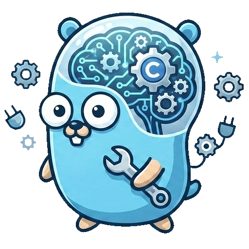
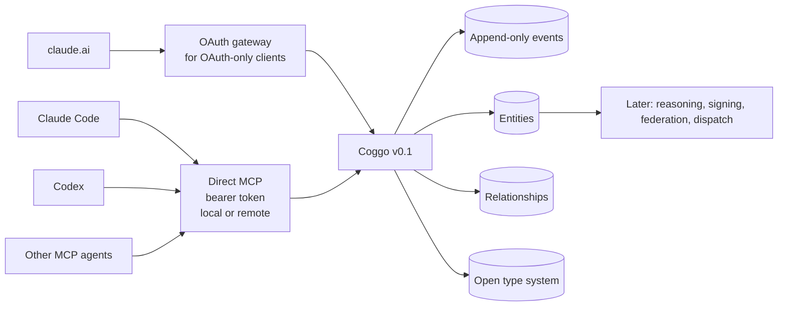
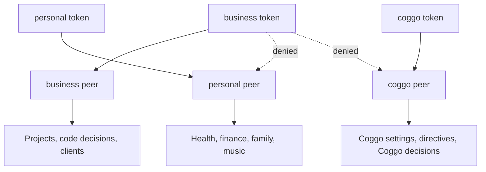

<p align="center">
  
</p>

# Coggo

Coggo is durable shared context for AI tools: Claude Code, Codex, claude.ai, and other MCP-capable agents can read and write the same local memory instead of starting from scratch in every session.

## What Coggo Is Today

Coggo v0.1 is a single-user, local-first knowledge substrate. It stores entities, relationships, and append-only events across explicit peers such as `personal`, `business`, and `coggo`. It exposes those records through an MCP server, so AI clients can query project state, record decisions, and reuse context across otherwise isolated tools.

Coggo does not yet reason, dispatch agents, sign events, or network-federate between Coggo instances. Current value is shared durable context and memory. The AI clients still bring their own reasoning.

## What Coggo Aims To Become

Coggo is intended to grow into a federated synthetic intelligence: a software entity that holds state, reasons over it, operates inside explicit boundaries, and produces inspectable evidence of what it did. The substrate in v0.1 is the base layer for later reasoning, cryptographic provenance, network federation, and agent dispatch.



## Try It Locally In 5 Minutes

```bash
go install github.com/lunguini/coggo/cmd/coggo@v0.1.1
coggo init
coggo token create --peer business --label codex-local
export COGGO_TOKEN='paste-token-here'
coggo serve
```

Use a version tag such as `@v0.1.1` for a specific stable release. Use `@latest` for the newest tagged release. Use `@main` only if you explicitly want the current development branch.

After the first public release, macOS users can also install the release binary from the Homebrew tap:

```bash
brew install --cask lunguini/tap/coggo
```

If you are developing Coggo itself, clone the repo and use `make install` for the version stamp and `PATH` warning.

Coggo serves MCP at:

```text
http://localhost:6177/mcp
```

Connect Codex:

```bash
codex mcp add coggo-local \
  --url http://localhost:6177/mcp \
  --bearer-token-env-var COGGO_TOKEN
```

Connect Claude Code by adding Coggo to Claude Code's MCP config; see [docs/claude-code-setup.md](docs/claude-code-setup.md). Some Claude Code versions also support a CLI-based `claude mcp add` flow; the docs show the JSON config path because it is explicit and easy to inspect.

Smoke-test the connection from your AI client by asking it to call:

```text
coggo_type_list(peer="coggo")
```

On a fresh install, the response should include seed types such as `Project`, `Decision`, `Goal`, `Observation`, and `Setting`.

A future setup helper may detect local Claude Code and Codex config paths and print or apply MCP setup automatically. That helper is intentionally not part of this README rewrite; the current setup path is manual and inspectable.

## Why Peers Matter

Peers are Coggo's authorization boundaries. A token can be scoped to one peer, several peers, or all peers. If a client has a `business` token, it cannot read `personal` data just because the user asks for it.



The default `coggo init` creates:

- `personal` for private life domains.
- `business` for work, code, clients, and project decisions.
- `coggo` for Coggo's own configuration and decision history.

## Core Concepts

- **Peer:** A unit of identity, ownership, and authorization. Peers are the boundary around data.
- **Entity:** A thing Coggo remembers, such as a `Project`, `Decision`, `Goal`, or `Observation`.
- **Relationship:** A typed edge between entities, such as `depends_on`, `supersedes`, or `affects`.
- **Event:** An immutable record of a state change. Entities and relationships are projections of events.
- **Type:** A schema defined as data. AI clients should call `coggo_type_list` before creating entities.

For the full schema, see [docs/SCHEMA.md](docs/SCHEMA.md). For MCP tools, see [docs/api.md](docs/api.md).

## Common Commands

```bash
coggo today                         # daily briefing across peers
coggo today --peer business         # daily briefing for one peer

coggo decision new                  # log a Decision
coggo goal new                      # log a Goal
coggo observation new               # log an Observation

coggo entity new <Type> --peer <name>
coggo entity list <Type> --peer <name>
coggo entity show <id> --peer <name>

coggo type list --peer <name>
coggo type add

coggo peer list
coggo peer add <name>

coggo token create --peer business
coggo token create --peer business --peer personal
coggo token create --all
```

## Local AI Client Setup

### Codex

```bash
coggo token create --peer business --label codex-local
export COGGO_TOKEN='paste-token-here'
coggo serve
codex mcp add coggo-local \
  --url http://localhost:6177/mcp \
  --bearer-token-env-var COGGO_TOKEN
```

See [docs/codex-setup.md](docs/codex-setup.md) for a longer walkthrough, smoke tests, and troubleshooting.

### Claude Code

```bash
coggo token create --peer business --label claude-code
coggo serve
```

Then add Coggo to Claude Code's MCP config and install the repo prompt template. See [docs/claude-code-setup.md](docs/claude-code-setup.md).

### claude.ai

claude.ai custom connectors require OAuth 2.1, not a static bearer token. Use the OAuth gateway plus Cloudflare Tunnel path in [docs/claude-ai-setup.md](docs/claude-ai-setup.md). Other MCP clients that can send bearer tokens may connect directly to Coggo over a local or remote URL.

### Remote Bearer-Token MCP

Coggo does not have to run on the same machine as the MCP client. If the client can send an `Authorization: Bearer ...` header, it can connect directly to any HTTPS endpoint that reaches `coggo serve`:

```bash
coggo token create --peer business --label codex-remote
export COGGO_TOKEN='paste-token-here'
codex mcp add coggo-remote \
  --url https://coggo.example.com/mcp \
  --bearer-token-env-var COGGO_TOKEN
```

Use direct remote MCP for trusted clients and private transports where bearer-token auth is acceptable. Use `coggo-oauth-gateway` for public browser/mobile/OAuth-only clients, email allowlists, and gateway rate limiting.

## Roadmap

- [x] **v0.1 substrate:** storage, peers, MCP, open types, daily briefing.
- [ ] **v0.2 reasoning loop:** bring-your-own LLM, context selection, validated write-back.
- [ ] **v0.3 cryptographic identity:** signed events and verifiable provenance.
- [ ] **v0.4 network federation:** Coggo-to-Coggo transport across machines.
- [ ] **v0.5 agent dispatch:** send work to Claude Code, Codex, and other tools.
- [ ] **v0.6 autonomy:** proactive engagement within explicit directives.
- [ ] **v0.7 BCPC enforcement:** boundaries, consent, provenance, and continuity as enforceable contracts.
- [ ] **v0.8 inter-user federation:** negotiated cross-user Coggo interactions.
- [ ] **v0.9 self-improvement:** proposals and implementation loops for Coggo itself.
- [ ] **v1.0 public stability:** stable docs, migrations, governance, and adoptability.

The version numbers are planning anchors, not promises. The trunk is v0.1 substrate and v0.2 reasoning; later branches may change as real usage shapes the system.

## Documentation

- [docs/SCHEMA.md](docs/SCHEMA.md) — entity types, relationship types, and event vocabulary.
- [docs/api.md](docs/api.md) — MCP tool reference.
- [docs/codex-setup.md](docs/codex-setup.md) — wiring Codex to local Coggo.
- [docs/claude-code-setup.md](docs/claude-code-setup.md) — wiring Claude Code to local Coggo.
- [docs/claude-ai-setup.md](docs/claude-ai-setup.md) — wiring claude.ai through OAuth and Cloudflare Tunnel.
- [docs/remote-bearer-mcp.md](docs/remote-bearer-mcp.md) — direct remote MCP for bearer-token clients.
- [docs/cloudflare-tunnel.md](docs/cloudflare-tunnel.md) — supported public exposure path for Termux and OAuth-only clients.
- [docs/backup.md](docs/backup.md) — SQLite/Litestream backup plus peer identity export/import.
- [docs/tailscale-setup.md](docs/tailscale-setup.md) — legacy bearer-token public access notes.
- [SECURITY.md](SECURITY.md) — security posture and vulnerability reporting.
- [CONTRIBUTING.md](CONTRIBUTING.md) — development setup and contribution checks.

## Security Notes

Raw `coggo serve` uses bearer-token authentication and stays localhost-bound by default. It can be exposed to trusted MCP clients that support bearer tokens, but public browser, mobile, or OAuth-only access should go through `coggo-oauth-gateway` and Cloudflare Tunnel.

`peers.json` contains hosted peer private keys. It is deliberately outside Litestream database backup; export and store it separately with `coggo backup identity export`.

## License

Apache 2.0. See [LICENSE](LICENSE).
