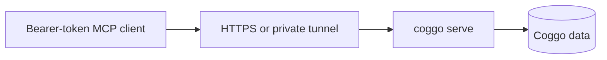

# Remote Bearer-Token MCP

Coggo's raw MCP server uses bearer-token authentication. It is localhost-bound by default, but it can be reached remotely when you deliberately put a trusted transport in front of it.

Use this path for MCP clients that can send an `Authorization: Bearer ...` header directly, such as Codex, Claude Code, curl, scripts, or private automation.

Do not use this path for OAuth-only clients such as claude.ai custom connectors. For those, use [claude-ai-setup.md](claude-ai-setup.md), [cloudflare-tunnel.md](cloudflare-tunnel.md), and `coggo-oauth-gateway`.

## Shape



The remote layer is responsible for TLS, routing, and any network-level access policy. Coggo still enforces peer-scoped bearer tokens on every MCP request.

## 1. Run Coggo

On the host that owns the Coggo data:

```bash
coggo init
coggo token create --peer business --label remote-mcp
coggo serve
```

By default, Coggo listens on `localhost:6177`. Keep that default unless you have a deliberate reason to bind more broadly. A reverse proxy, SSH tunnel, WireGuard/Tailscale tunnel, or similar transport can forward remote HTTPS traffic to local Coggo.

## 2. Expose a Trusted URL

Point your chosen transport at:

```text
http://localhost:6177/mcp
```

The public or private client-facing URL should be HTTPS, for example:

```text
https://coggo.example.com/mcp
```

Raw Coggo does not provide OAuth login, email allowlists, or gateway rate limiting. If you need those controls, put `coggo-oauth-gateway` in front instead of exposing raw Coggo.

## 3. Connect Codex

```bash
export COGGO_TOKEN='paste-token-here'
codex mcp add coggo-remote \
  --url https://coggo.example.com/mcp \
  --bearer-token-env-var COGGO_TOKEN
```

## 4. Connect Claude Code

Use the same JSON shape as [claude-code-setup.md](claude-code-setup.md), but replace the URL:

```json
{
  "mcpServers": {
    "coggo-remote": {
      "type": "http",
      "url": "https://coggo.example.com/mcp",
      "headers": {
        "Authorization": "Bearer paste-token-here"
      }
    }
  }
}
```

Restart Claude Code after editing its MCP config.

## 5. Smoke Test

From the remote client, call:

```text
coggo_type_list(peer="coggo")
```

If the request reaches Coggo without a token, Coggo returns HTTP 401. If the token is valid but does not cover the target peer, Coggo returns HTTP 403.

## Security Notes

- Prefer peer-scoped tokens over `--all`.
- Rotate a token immediately if it appears in logs, shell history, screenshots, or shared config.
- Keep raw bearer-token MCP on trusted networks or behind a transport you control.
- Use the OAuth gateway for public browser/mobile access, OAuth-only clients, email allowlists, and gateway rate limiting.
